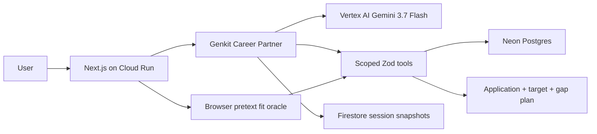

# MagicResume

MagicResume is an evidence-first career partner that remembers a person's work, asks
the questions that uncover real impact, and turns each opportunity into a
truthful application plus a concrete plan to close gaps before a recruiter
sees it.

Live deployment:
[mr-career-partner-g3larw422q-uc.a.run.app](https://mr-career-partner-g3larw422q-uc.a.run.app)

## What the partner does

- Imports an existing resume into provisional, provenance-linked career memory.
- Asks one focused question at a time about ownership, scope, outcome,
  constraints, and evidence.
- Requires explicit confirmation before a remembered fact can enter an
  application.
- Parses a pasted JD and labels every capability as demonstrated, transferable,
  currently learning, or missing.
- Produces a grounded application resume, a private target-state preview, and
  evidence-building tasks.
- Preserves common single-, sidebar-, two-, and three-column resume structures
  as bounded regions, while reporting graphic-heavy features it cannot safely
  reproduce.
- Uses the PDF page render as the design authority for split-name color,
  professional-title placement, labeled contact grids, summary headings,
  standalone rules, bands, accents, typography, and region geometry. Complex
  multi-region imports receive one focused visual-validation pass before the
  bounded document is normalized.
- Saves reusable resume designs separately from personal content, private by
  default.
- Learns explicit wording/content preferences from feedback.
- Explains ATS readiness as 55% deterministic checks plus 45% grounded Gemini
  review, including exact JD evidence and an explicit fallback formula.
- Runs a browser-only pretext fit oracle that searches typography/spacing,
  region geometry, horizontal contact wrapping, and whole-section placement
  across standard parallel columns without crossing readability floors.

## Integrity boundary

- Application resumes contain only facts the user supplied. Confirmation is
  optional reassurance, not a gate — the product does not verify employment
  history.
- Every generated application claim carries canonical source fact IDs.
- Aspirational skills appear only in a persistently watermarked target preview.
- Target previews are blocked from print, PDF export, saving, and public share.
- The deterministic validator rejects ungrounded application content even when
  the model produced structurally valid JSON.

## Architecture



Neon Postgres owns canonical career facts, sources, preferences, JDs, applications,
learning goals, and feedback. Firestore stores user-isolated Genkit snapshots
and conversation history. The browser remains the only layout measurement
environment; no server Chromium is used.

Career-memory imports and saved resumes reconcile equivalent tenant-owned facts
through stable evidence fingerprints. Each source retains independent
provenance, while the UI reports total, confirmed, needs-review, aspirational,
and rejected counts. Confirmation is never inferred from duplicate content.

Resume layout is a versioned set of bounded rows, columns, regions, and content
placements, including content-free standalone horizontal and vertical rules.
Identity/contact presentation remains editable through bounded style tokens;
the pure renderer and virtual fit measurer mirror the same typography and flow
geometry. Standard sidebar/two-/three-column presets may carry fit-only section
placement and contact-flow overrides so preview, print, save, and share all use
the same balanced result; custom/imported layouts remain fixed for source
fidelity. Design templates store only normalized layout/theme data and a design
fingerprint; they never copy resume content.

## Local development

Requirements: Node.js 22, npm, and Google Cloud CLI.

```bash
cp .env.example .env.local
gcloud auth application-default login
npm install
npx drizzle-kit migrate
npm run dev
```

Migration `0004_exotic_talisman.sql` adds design-template persistence. Generate
and inspect migrations locally with `npm run db:generate`; applying them to
Neon remains a separate production operation.

Set `GOOGLE_CLOUD_PROJECT` in `.env.local` to a project with Vertex AI enabled.
Every Gemini path uses GA `gemini-3.7-flash` in the `global` location through
Genkit. Routine extraction, ATS, compression, and partner turns use low or
medium thinking; difficult layout extraction and career/JD synthesis use high
thinking with bounded retries and deterministic fallback.

Without `DATABASE_URL`, local development uses embedded PGlite at `.pglite/`.
Without Google OAuth credentials, development exposes Auth.js's local email
login. Production intentionally disables that provider.

To test Firestore sessions locally, run the Firestore emulator and set:

```bash
FIRESTORE_EMULATOR_HOST=127.0.0.1:8080
```

## Verification

```bash
npm run lint
npm run test
npm run build
npm run test:e2e
```

The suite covers the inherited renderer/import/fit/ATS behavior plus career
provenance, truthful export enforcement, target export blocking, migration
integrity, user scoping, stable cross-source reconciliation, layout rendering,
two-axis fitting, template content isolation, ATS scoring transparency, and the
mocked collaborative browser journey. Tests that require live Gemini or a
Firestore emulator are opt-in.

## Google Cloud provisioning

Enable these APIs:

```bash
gcloud services enable \
  aiplatform.googleapis.com \
  artifactregistry.googleapis.com \
  cloudbuild.googleapis.com \
  firestore.googleapis.com \
  run.googleapis.com \
  secretmanager.googleapis.com
```

Provision:

1. An Artifact Registry Docker repository named `mr`.
2. A dedicated `mr` database in Neon. It may share an existing Neon project's
   compute, but must not share another application's database or schema.
3. Firestore in Native mode.
4. A service account named `mr-career-partner`.
5. Secret Manager values:
   `mr-database-url`, `mr-auth-secret`, `mr-google-client-id`, and
   `mr-google-client-secret`.

Use a pooled Neon connection string with TLS enabled and store it directly as
`mr-database-url`. Never put the connection string in source or Cloud Build
substitutions.

Grant the runtime service account:

- Vertex AI User
- Datastore User
- Secret Manager Secret Accessor
- Cloud Trace Agent
- Monitoring Metric Writer
- Logs Writer

The Auth.js Google OAuth redirect URI is:

```text
https://YOUR_CLOUD_RUN_HOST/api/auth/callback/google
```

Set `AUTH_URL` to the canonical HTTPS Cloud Run origin and
`AUTH_TRUST_HOST=true`; `cloudbuild.yaml` configures both so Auth.js accepts
Cloud Run's forwarded host.

## Build, migrate, and deploy

`next.config.ts` emits standalone output. `Dockerfile` is a multi-stage,
non-root image. Database migrations are run by a Cloud Run Job before the
service revision is deployed.

```bash
gcloud builds submit \
  --project YOUR_PROJECT_ID \
  --config cloudbuild.yaml \
  --substitutions=_REGION=us-central1
```

The pipeline builds and pushes the image, deploys and executes the migration
job against Neon, then deploys the service with Neon, Firestore, Vertex AI, and
Secret Manager.
The health endpoint is `/api/health`.

Cloud Run automatically enables Genkit's Google Cloud telemetry exporter.
Prompt/response payload logging is disabled because career and resume data is
sensitive; traces retain model/tool timing and operation metadata.

## Hackathon disclosure

This entry targets the Collaborative Partner category of the All Things
Agentic Hackathon.

The project began as a copy of the pre-existing MagicResume codebase. Reused
work includes its pure resume renderer, browser pretext measurement and
auto-fit algorithm, PDF/screenshot import pipeline, ATS checks, editor,
client-side print export, Auth.js setup, and resume persistence.

Hackathon-period work in this repository includes the evidence/provenance
domain, integrity validator, career-memory persistence, Genkit agent and tools,
Gemini 3.7 Vertex integration, Firestore session isolation, JD evidence/gap
pipeline, target-state export boundary, preparation goals, feedback learning,
collaborative workspace, Cloud Run/Neon deployment, telemetry, and the
submission demo/tests.
